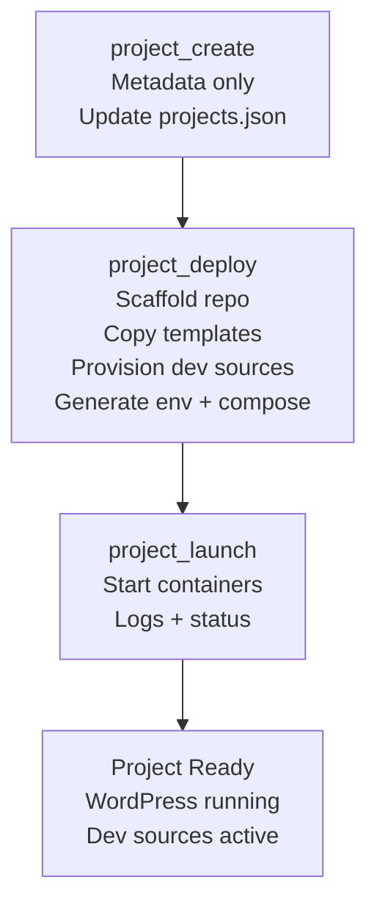

# **PTEKWPDEV — Project Lifecycle Guide**

This document describes the **day‑to‑day workflow** for creating, deploying, and launching projects in the PTEKWPDEV platform.  
Unlike the app lifecycle (which is rarely performed), the project lifecycle is used **every time a new WordPress project is created**.

The project lifecycle consists of three major stages:

1. **Create the project**  
   Register metadata in `projects.json`.

2. **Deploy the project**  
   Scaffold the project directory, copy templates, provision dev sources, and generate Docker config.

3. **Launch the project**  
   Start, stop, restart, and manage project containers.

Once complete, the project is fully operational and ready for development.

---

# **0. Overview**

A project in PTEKWPDEV is defined by:

- a unique project key  
- a domain  
- a Docker network  
- a base directory under `PROJECT_BASE`  
- WordPress ports  
- database + admin secrets  
- optional dev sources (plugins/themes)

All project metadata lives in:

```
$CONFIG_BASE/config/projects.json
```

All project runtime files live in:

```
$PROJECT_BASE/<project_key>/
```

---

## **🔑 Key Concept: What is a “Project”?**

A **project** is a fully isolated WordPress environment with:

- its own directory  
- its own Docker Compose file  
- its own `.env`  
- its own dev sources  
- its own WordPress installation  
- its own frontend network  

Projects share only:

- the global backend network  
- the global database container  
- the global asset volume  

Everything else is isolated and self‑contained.

---

# **1. Create a Project (`project_create.sh`)**

This step registers the project in the global project registry:

```
$CONFIG_BASE/config/projects.json
```

It does **not** create files, directories, or containers.  
It is **metadata only**.

### **Command**

```bash
cd $HOME/projects/ptekwpdev/bin
./project_create.sh --project demo --domain demo.local --network ptekwpdev_demo_net --base-dir demo
```

If values are omitted, the script will prompt interactively.

### **What This Step Does**

- Validates the project key  
- Ensures the project does not already exist  
- Generates database + WordPress admin secrets  
- Inserts a new project block into `projects.json`  
- Optionally provisions dev sources  
- Optionally triggers project deployment  

### **Artifacts Created**

| Path | Description |
|------|-------------|
| `$CONFIG_BASE/config/projects.json` | Updated with new project entry |

### **State After This Step**

- The project exists in metadata  
- No files or containers exist yet  
- The project is ready for deployment  

---

# **2. Deploy the Project (`project_deploy.sh`)**

This step prepares the **filesystem** for the project.  
It copies templates, provisions dev sources, and generates Docker configuration.

It does **not** start containers.

### **Command**

```bash
./project_deploy.sh --project demo --action deploy
```

### **What This Step Does**

### ✔ Scaffolds the project directory

Creates:

```
PROJECT_REPO/
  docker/
  config/
  config/proxy/
  config/wordpress/
  config/sqladmin/
  config/doc/
  src/plugins/
  src/themes/
  logs/
```

### ✔ Copies runtime templates

From:

```
$CONFIG_BASE/docker/
$CONFIG_BASE/config/
```

Into:

```
$PROJECT_REPO/docker/
$PROJECT_REPO/config/
```

### ✔ Provisions dev sources

For each plugin/theme defined in `projects.json`:

- local → copied  
- remote → cloned  
- optional `.git` removal  
- existing directories preserved  

### ✔ Generates project-level `.env`

From:

```
$CONFIG_BASE/config/env.project.tpl
```

### ✔ Generates `compose.project.yml`

From:

```
$CONFIG_BASE/docker/compose.project.yml
```

### ✔ Optional: WordPress provisioning

```bash
./project_deploy.sh --project demo --action deploy_wordpress
```

This installs WordPress core into:

```
PROJECT_REPO/wordpress/
```

### **Artifacts Created**

| Path | Description |
|------|-------------|
| `$PROJECT_REPO/docker/.env` | Project-level environment variables |
| `$PROJECT_REPO/docker/compose.project.yml` | Project-level Docker Compose file |
| `$PROJECT_REPO/src/plugins/*` | Provisioned plugin dev sources |
| `$PROJECT_REPO/src/themes/*` | Provisioned theme dev sources |
| `$PROJECT_REPO/config/*` | Project-specific container configs |

### **State After This Step**

- The project directory is fully provisioned  
- All templates and configs are in place  
- Dev sources are copied or cloned  
- WordPress core may be installed  
- Containers are **not** running yet  

Next step:

```
project_launch.sh --project demo --action start
```

---

# **3. Launch the Project (`project_launch.sh`)**

This step manages **runtime orchestration** — starting, stopping, and inspecting containers.

### **Command**

```bash
./project_launch.sh --project demo --action start
```

### **Supported Actions**

| Action | Description |
|--------|-------------|
| `start` | Start project containers |
| `stop` | Stop project containers |
| `restart` | Stop then start containers |
| `status` | Show container status |
| `logs` | Stream container logs |
| `refresh` | Down + Up (safe refresh) |

### **What This Step Does**

- Validates that `.env` and compose files exist  
- Starts containers using:

```
docker compose -f compose.project.yml --env-file .env up -d
```

- Provides logs and status commands  
- Supports safe refresh operations  

### **State After This Step**

- The project is fully operational  
- WordPress is running  
- Dev sources are mounted  
- The environment is ready for development  

---

# **4. Full Project Lifecycle Diagram**



---

# **5. Next Steps**

For a complete hands‑on example, see:

👉 **`examples/demo_project_run.md`**

This example walks through creating, deploying, and launching a real “demo” project with a minimal theme and plugin.
