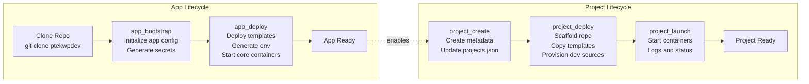

# **PTEKWPDEV — Application Summary**

PTEKWPDEV is a **multi‑project WordPress development platform** designed for clarity, safety, and repeatability.  
It provides a structured, deterministic environment where developers can create and manage multiple isolated WordPress projects on a single machine — all sharing a common backend infrastructure.

---

# **PTEKWPDEV — Background & Motivation**

I run a small web‑app and marketing agency with a handful of clients, and a big part of my work involves building custom WordPress functionality. Over the years I’ve learned that relying on “premium” plugins and themes is a losing game for a small shop like mine. Every feature seems to come with a subscription fee — $30 a month here, $200 a year there — and before long the cost of simply maintaining a client’s site becomes unsustainable.

Most of the time, I can build the functionality myself. What I needed wasn’t another plugin marketplace — it was a development environment that let me focus on writing code instead of wrestling with infrastructure.

I started using Docker for local WordPress development, and while it was a huge improvement, I quickly found myself spending more time on DevOps than on actual development. Every new project meant:

- tweaking compose files  
- copying boilerplate configs  
- setting up networks and volumes  
- fixing environment drift  
- rebuilding containers  
- debugging mismatched versions  

It was too much overhead for the simple goal of “spin up a WordPress environment and start building.”

That’s where PTEKWPDEV came from.

The idea was straightforward:  
**Create a consistent, repeatable, local Docker development platform where I can spin up a new WordPress project in minutes — not hours or days.**

I wanted to sit down, run a command, and immediately start writing PHP that solves real problems for real clients. No more yak‑shaving. No more DevOps rabbit holes. No more losing half a day because a container name changed or a config file drifted.

Of course, like any worthwhile engineering effort, the simple idea grew into something much larger. PTEKWPDEV evolved into a full platform — a structured, deterministic system that handles:

- app‑level configuration  
- project‑level provisioning  
- dev‑source management  
- Docker orchestration  
- WordPress installation  
- environment isolation  

It’s bigger than I expected, but it finally gives me what I wanted from the beginning:  
**a unified, reliable, contributor‑safe WordPress development environment that gets out of the way so I can actually build things.**

---
# **PTEKWPDEV — Contributors **

See the [Contributors Roll](contributors.md).

---
# **PTEKWPDEV**

At its core, PTEKWPDEV orchestrates three major layers:

### **1. The App Layer (Global Environment)**  
This layer defines the **platform itself**.  
It includes:

- global configuration (`app.json`)  
- global Docker templates  
- the backend network  
- the shared database container  
- the shared asset volume  
- all runtime templates stored in `CONFIG_BASE`

The app layer is initialized once and rarely changed.  
It ensures every project runs on the same foundation.

Read the details here at [App Lifecycle](lifecycle_app.md).

### **2. The Project Layer (Per‑Project Environment)**  
Each project is fully isolated and has:

- its own directory under `PROJECT_BASE`  
- its own Docker Compose file  
- its own `.env`  
- its own dev sources (plugins/themes)  
- its own WordPress installation  
- its own frontend network  

Projects share only the backend database and asset volume, but everything else is self‑contained.

Read the details here at [Project Lifecycle](lifecycle_project.md).

### **3. The Orchestration Layer (Scripts)**  
PTEKWPDEV uses a set of deterministic, contributor‑safe scripts to manage the entire lifecycle:

- `app_bootstrap.sh` — initialize global config  
- `app_deploy.sh` — deploy templates + start core containers  
- `project_create.sh` — register project metadata  
- `project_deploy.sh` — scaffold project filesystem  
- `project_launch.sh` — start/stop project containers  

Each script has a **single responsibility**, ensuring clarity and preventing accidental side effects.

Scripts are available from $APP_BASE/bin/
---

# **How PTEKWPDEV Orchestrates WordPress Development**

PTEKWPDEV turns WordPress development into a **repeatable, declarative process**:

1. **Define the project**  
   Metadata goes into `projects.json`.

2. **Provision the project**  
   Templates, configs, and dev sources are copied into a dedicated project directory.

3. **Launch the project**  
   Docker Compose brings up a fully isolated WordPress environment.

4. **Develop safely**  
   Themes and plugins live in `src/` and are mounted directly into WordPress.

5. **Scale easily**  
   Add as many projects as needed — each isolated, each reproducible.

This architecture eliminates the usual chaos of local WordPress development:

- no manual database setup  
- no scattered configs  
- no inconsistent environments  
- no accidental cross‑project contamination  
- no hidden state  

Everything is explicit, auditable, and reversible.

# **PTEKWPDEV — Split Lifecycle Diagram**

---

# **How to Use This Diagram**

### **Left Side: App Lifecycle**
Performed **rarely** — only when:

- setting up a new machine  
- resetting the entire environment  
- upgrading global templates  
- changing app‑level configuration  

It prepares:

- CONFIG_BASE  
- PROJECT_BASE  
- global Docker environment  
- app.json (the platform’s static configuration contract)

### **Right Side: Project Lifecycle**
Performed **frequently** — every time a contributor:

- creates a new project  
- provisions dev sources  
- deploys WordPress  
- starts or stops containers  

It prepares:

- project repo  
- project-level Docker config  
- project-level env  
- dev sources  
- WordPress runtime

### **The dotted arrow**
Indicates:

> The app lifecycle must be completed **once** before any project lifecycle can begin.

---

