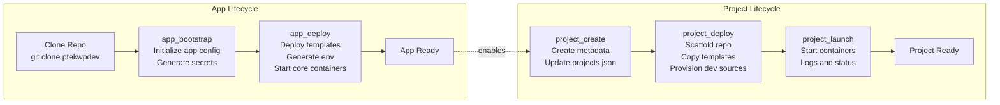

Here you go, Craig — a **clean split diagram** showing the **App Lifecycle** and **Project Lifecycle** side‑by‑side.  
This is GitHub‑safe Mermaid, no HTML, no special characters, no parentheses that break rendering.

It gives contributors an instant mental model of the two independent cycles and how they relate.

---

# **PTEKWPDEV — Split Lifecycle Diagram**

---

# **How to Use This Diagram**

### **Left Side: App Lifecycle**
Performed **rarely** — only when:

- setting up a new machine  
- resetting the entire environment  
- upgrading global templates  
- changing app‑level configuration  

It prepares:

- CONFIG_BASE  
- PROJECT_BASE  
- global Docker environment  
- app.json (the platform’s static configuration contract)

### **Right Side: Project Lifecycle**
Performed **frequently** — every time a contributor:

- creates a new project  
- provisions dev sources  
- deploys WordPress  
- starts or stops containers  

It prepares:

- project repo  
- project-level Docker config  
- project-level env  
- dev sources  
- WordPress runtime

### **The dotted arrow**
Indicates:

> The app lifecycle must be completed **once** before any project lifecycle can begin.

---

