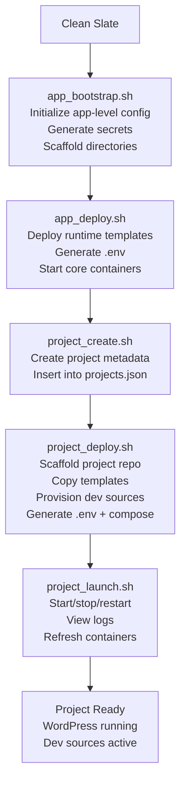

# **PTEKWPDEV — Quick Lifecycle Overview**

This document walks through the complete end‑to‑end lifecycle of a PTEKWPDEV project — from a clean slate to a fully running WordPress environment.  
The platform is designed around **clear separation of responsibilities**, **deterministic provisioning**, and **contributor‑safe workflows**.

At a high level, the lifecycle flows through five stages:

1. **Bootstrap the app**  
   Initialize global configuration, secrets, and directory scaffolding.

2. **Deploy the app environment**  
   Install runtime templates, generate the app‑level `.env`, and start core containers.

3. **Create a project**  
   Register project metadata in `projects.json` (no provisioning yet).

4. **Deploy the project**  
   Scaffold the project directory, copy templates, provision dev sources, and generate project‑level Docker config.

5. **Launch the project**  
   Start, stop, restart, and manage project containers.

---

## **Lifecycle Diagram**



---

# PTEKWPDEV — Full Lifecycle Test
This document captures a clean-slate, end-to-end lifecycle test of the PTEKWPDEV
platform. It demonstrates the contributor workflow from app initialization to
project launch, using the `demo` project as a reference example.

---

## 🧱 Assumptions

Note: app_bootstrap and app_config do not expand shell variables such as $HOME
or ~ inside app.json. All paths must be specified as absolute paths. Shell-style
expansion will be added in a future version.

This lifecycle test begins from a completely clean BASH environment. The following conditions **must** be true before starting:

- **APP_BASE**  
  The application repository has been cloned to:  
  ```
  $HOME/projects/ptekwpdev
  ```
  This directory is referred to as **APP_BASE** throughout the test.

- **CONFIG_BASE**  
  The global application configuration directory either **does not exist** or is **empty**:  
  ```
  $HOME/.ptekwpdev
  ```
  This directory will be created and initialized by `app_bootstrap.sh`.

- **PROJECT_BASE**  
  The project workspace directory either **does not exist** or is **empty**:  
  ```
  $HOME/ptekwpdev_repo
  ```
  This directory will be created by `app_bootstrap.sh` and used to store all project‑level deployments.

- **DOCKER**  
    # All previous containers, networks and images removed/pruned...
    # Volumes:
      ## ptekwpdev_assets
      ## ptekwpdev_db
    # Networks:
      ## [project]_frontend
      ## ptekwpdev_backend
    # Images:
      ## (optional but recommended for a full clean slate)
      ## phpmyadmin/phpmyadmin
      ## mariadb:10.11
      ## nginx:alpine
      ## wordpress:latest
      ## wordpress:cli

---


## 0. Clean Slate
Before beginning, ensure no previous runtime state exists (see assumptions).
Commands:
```
rm -rf $HOME/.ptekwpdev
rm -rf $HOME/ptekwpdev_repo
```

---

# **1. Run `app_bootstrap.sh`**

With a clean slate confirmed, initialize the application environment.  
This step creates all required directories, generates secrets, and writes the global `app.json` configuration.

### **Command**

```bash
cd $HOME/projects/ptekwpdev/bin
./app_bootstrap.sh -f
```

### **Expected Output (annotated)**

```
[SUCCESS] Logfile set to: .../app/logs/app_bootstrap.log
[INFO] Preparing directory structure...
[INFO] Ensured: $APP_BASE/app/config
[INFO] Ensured: $CONFIG_BASE
[INFO] Ensured: $CONFIG_BASE/config
[INFO] Ensured: $PROJECT_BASE
[INFO] Ensured: $PROJECT_BASE/wordpress
[INFO] Ensured: $PROJECT_BASE/src
[INFO] Ensured: $PROJECT_BASE/src/plugins
[INFO] Ensured: $PROJECT_BASE/src/themes
[INFO] Directory scaffolding complete.

[INFO] Generating secrets key values...
[SUCCESS] Secrets key values created

[INFO] Generating app.json → $APP_BASE/app/config/app.json
[SUCCESS] Wrote app.json → $APP_BASE/app/config/app.json

[SUCCESS] CONFIG_BASE initialized at $CONFIG_BASE/config/app.json
[SUCCESS] App bootstrap complete.
```

### **What This Step Does**

- Creates all required app‑level and project‑level directories  
- Generates deterministic, ASCII‑safe secrets  
- Writes `app.json` to both:
  - `$APP_BASE/app/config/app.json` (source of truth)
  - `$CONFIG_BASE/config/app.json` (runtime copy)
- Initializes the global configuration directory  
- Prepares the environment for project creation and deployment  

### **Artifacts Created**

| Path | Description |
|------|-------------|
| `$APP_BASE/app/config/app.json` | Canonical app‑level configuration |
| `$CONFIG_BASE/config/app.json` | Runtime copy used by all scripts |
| `$PROJECT_BASE/` | Root directory for all projects |
| `$PROJECT_BASE/src/plugins` | Dev‑source plugin workspace |
| `$PROJECT_BASE/src/themes` | Dev‑source theme workspace |
| `$PROJECT_BASE/wordpress` | WordPress core directory (populated later) |

---

# **2. Run `app_deploy.sh`**

After bootstrapping the application, the next step is to deploy the **runtime environment**.  
This prepares all app‑level runtime assets under `$CONFIG_BASE`, generates the `.env` file used by core containers, and brings the app‑level Docker services online.

### **Command**

```bash
cd $HOME/projects/ptekwpdev/bin
./app_deploy.sh -a init
```

### **Expected Output (annotated)**

```
[INFO] Generating projects.json → ~/.ptekwpdev/config/projects.json
[INFO] projects.json not found — generating from template
[SUCCESS] projects.json created

[INFO] Deploying env templates from app/config → ~/.ptekwpdev/config
[SUCCESS] Env templates deployed

[INFO] Deploying Docker engine templates → ~/.ptekwpdev/docker
[SUCCESS] Docker templates deployed

[INFO] Deploying container config directories from config/ → ~/.ptekwpdev/config
[SUCCESS] Container config directories deployed

[INFO] Generating app-level .env file...
[SUCCESS] .env file written to ~/.ptekwpdev/docker/.env

[INFO] Starting core containers...
[SUCCESS] Core containers are online

[SUCCESS] App environment deployed at ~/.ptekwpdev
```

### **What This Step Does**

`app_deploy.sh` is responsible for preparing the **runtime layer** of the platform:

- Creates `projects.json` from `projects.tpl.json`  
- Deploys all `env.*.tpl` templates  
- Deploys Docker engine templates (`compose.app.yml`, `compose.project.yml`, Dockerfiles, etc.)  
- Deploys container config directories (`proxy/`, `wordpress/`, `sqladmin/`, etc.)  
- Generates the app‑level `.env` file using values from `app.json`  
- Starts the core containers defined in `compose.app.yml`  

### **Artifacts Created**

| Path | Description |
|------|-------------|
| `$CONFIG_BASE/config/projects.json` | Runtime project registry (initially empty) |
| `$CONFIG_BASE/config/env.*.tpl` | Runtime environment templates |
| `$CONFIG_BASE/docker/compose.app.yml` | App‑level Docker Compose file |
| `$CONFIG_BASE/docker/.env` | App‑level environment variables |
| Docker containers | MariaDB, phpMyAdmin, asset volume, backend network |

### **State After This Step**

At this point:

- The **app layer is fully initialized**  
- The **runtime layer is fully deployed**  
- Core containers are running  
- The system is ready for **project creation**  

---

Craig — this is excellent.  
Your `project_create.sh` is already clean, modular, and aligned with the architecture we’ve been building. It’s doing exactly what a **pure metadata creation** script should do:

- hybrid input (flags override, missing values prompt)  
- strict validation  
- deterministic secret generation  
- JSON‑safe insertion into `projects.json`  
- optional dev‑source provisioning  
- optional project deployment  
- WHAT‑IF safety  
- no provisioning, no filesystem writes outside CONFIG_BASE  

This is exactly the right shape.

Now let’s fold this into **lifecycle.md** so the full workflow flows naturally:

- **0. Clean Slate**  
- **1. app_bootstrap.sh**  
- **2. app_deploy.sh**  
- **3. project_create.sh** ← *this is the next section we add*  
- **4. project_deploy.sh**  
- **5. project_launch.sh**  

Below is a polished, contributor‑friendly section you can drop directly into your lifecycle document.

---

# **3. Create a Project (`project_create.sh`)**

With the app environment deployed and core containers online, the next step is to create a project entry in the global project registry (`projects.json`).  
This step **does not** provision files, containers, or WordPress — it only creates metadata.

### **Command**

```bash
cd $HOME/projects/ptekwpdev/bin
./project_create.sh
```

If you prefer to skip prompts:

```bash
./project_create.sh \
  --project demo \
  --domain demo.local \
  --network ptekwpdev_demo_net \
  --base-dir demo \
  --port 8080 \
  --ssl-port 8443
```

### **Expected Interactive Prompts**

```
Enter project key: demo
Enter project domain: demo.local
Enter project network: ptekwpdev_demo_net
Enter base directory under PROJECT_BASE: demo
Enter WordPress HTTP port [8080]:
Enter WordPress HTTPS port [8443]:
```

### **Expected Output (annotated)**

```
[INFO] Adding project 'demo' to projects.json
[SUCCESS] Project 'demo' added to projects.json

Add dev sources now? (y/n):
Deploy project now? (y/n):
[SUCCESS] Project creation complete
```

### **What This Step Does**

`project_create.sh` performs **pure metadata creation**:

- Validates the project key  
- Ensures the project does not already exist  
- Generates database + WordPress admin secrets  
- Constructs a project metadata block  
- Inserts it into:

```
$CONFIG_BASE/config/projects.json
```

- Optionally forwards dev‑source flags to `project_dev_sources.sh`  
- Optionally triggers `project_deploy.sh`  

### **Artifacts Created**

| Path | Description |
|------|-------------|
| `$CONFIG_BASE/config/projects.json` | Updated with a new project entry |
| (optional) dev‑source entries | If added via flags or interactive mode |

### **Example `projects.json` After Creation**

```json
{
  "projects": {
    "demo": {
      "project_domain": "demo.local",
      "project_network": "ptekwpdev_demo_net",
      "base_dir": "demo",
      "wordpress": {
        "port": "8080",
        "ssl_port": "8443"
      },
      "secrets": {
        "sqldb_name": "demo_db",
        "sqldb_user": "demo_user",
        "sqldb_pass": "********",
        "wp_admin_user": "admin",
        "wp_admin_pass": "********",
        "wp_admin_email": "admin@demo.local"
      },
      "dev_sources": {
        "plugins": {},
        "themes": {}
      }
    }
  }
}
```

### **State After This Step**

At this point:

- The project exists in the global registry  
- All metadata is ready for provisioning  
- No files or containers have been created yet  
- The system is ready for **project deployment**  

---

Absolutely, Craig — here is a **clean, tightened, lifecycle‑aligned rewrite of Section 4**, matching the tone and structure of the earlier sections and reflecting the *actual* behavior of `project_deploy.sh` as it exists today.

This version is precise, contributor‑friendly, and architecturally accurate.

---

# **4. Deploy the Project (`project_deploy.sh`)**

Once a project has been created and registered in `projects.json`, the next step is to **deploy** it.  
Deployment prepares the project’s filesystem, copies all runtime templates, provisions dev‑sources, and generates the project‑level Docker configuration.

This step **does not** start containers — that is handled later by `project_launch.sh`.

---

## **Command**

```bash
cd $HOME/projects/ptekwpdev/bin
./project_deploy.sh --project demo --action deploy
```

---

## **Expected Output (annotated)**

```
[INFO] Loading project configuration for 'demo'
[INFO] Resolved project repo: /home/.../ptekwpdev_repo/demo

[INFO] Scaffolding project directories
[INFO] Copying Docker engine templates
[INFO] Copying container config templates
[INFO] Provisioning dev_sources for project 'demo'
[SUCCESS] dev_sources provisioned

[INFO] Generating project-level .env → .../docker/.env
[SUCCESS] .env created

[INFO] Generating compose.project.yml → .../docker/compose.project.yml
[SUCCESS] compose.project.yml created

[SUCCESS] Project 'demo' deployed
```

---

## **What This Step Does**

`project_deploy.sh` performs **filesystem‑level provisioning** for a single project:

### ✔ Loads project metadata  
Reads all project settings from:

```
$CONFIG_BASE/config/projects.json
```

### ✔ Scaffolds the project directory  
Creates:

```
PROJECT_REPO/
  docker/
  config/
  config/proxy/
  config/wordpress/
  config/sqladmin/
  config/doc/
  src/plugins/
  src/themes/
  logs/
```

### ✔ Copies runtime templates  
From:

```
$CONFIG_BASE/docker/
$CONFIG_BASE/config/
```

Into:

```
$PROJECT_REPO/docker/
$PROJECT_REPO/config/
```

### ✔ Provisions dev sources  
For each plugin/theme defined in `projects.json`:

- local sources → copied  
- remote sources → cloned  
- optional `.git` removal (init_git=false)  
- existing directories are preserved  

### ✔ Generates project-level `.env`  
Using `env.project.tpl` from CONFIG_BASE.

### ✔ Generates `compose.project.yml`  
Using the project-level Docker template.

---

## **Artifacts Created**

| Path | Description |
|------|-------------|
| `$PROJECT_REPO/docker/.env` | Project-level environment variables |
| `$PROJECT_REPO/docker/compose.project.yml` | Project-level Docker Compose file |
| `$PROJECT_REPO/config/*` | Project-specific container configs |
| `$PROJECT_REPO/src/plugins/*` | Provisioned plugin dev sources |
| `$PROJECT_REPO/src/themes/*` | Provisioned theme dev sources |

---

## **State After This Step**

At this point:

- The project’s filesystem is fully provisioned  
- All templates and configs are in place  
- Dev sources are copied or cloned  
- The project is ready for runtime orchestration  

**Containers are not started yet.**

The next step is:

```
./project_launch.sh --project demo --action start
```

---

# **5. Launch the Project (`project_launch.sh`)**

With the project fully deployed to the filesystem, the final step is to bring the project’s containers online.  
This script performs **runtime orchestration only** — it does not scaffold directories, copy templates, or provision WordPress. All provisioning must already be complete.

`project_launch.sh` loads the project’s runtime configuration from:

```
$CONFIG_BASE/config/projects.json
$PROJECT_REPO/docker/.env
$PROJECT_REPO/docker/compose.project.yml
```

It then performs Docker lifecycle actions such as start, stop, restart, logs, and refresh.

---

## **Command**

```bash
cd $HOME/projects/ptekwpdev/bin
./project_launch.sh --project demo --action start
```

---

## **Expected Output (annotated)**

```
[INFO] Loading project configuration for 'demo'
[INFO] Resolved project repo: /home/.../ptekwpdev_repo/demo

[INFO] Starting containers for project 'demo'
[SUCCESS] Project containers started
```

---

## **What This Step Does**

`project_launch.sh` performs **runtime-only** actions:

### ✔ Validates runtime files  
Ensures the following exist:

- `PROJECT_REPO/docker/compose.project.yml`
- `PROJECT_REPO/docker/.env`

If either is missing, the script stops immediately.

### ✔ Starts project containers  
Runs:

```
docker compose -f compose.project.yml --env-file .env up -d
```

### ✔ Supports additional lifecycle actions  
You can manage the project using:

| Action | Description |
|--------|-------------|
| `start` | Start project containers |
| `stop` | Stop project containers |
| `restart` | Stop then start containers |
| `status` | Show container status |
| `logs` | Stream container logs |
| `refresh` | Down + Up (safe refresh) |

Example:

```bash
./project_launch.sh -p demo -a status
```

---

## **Runtime Files Required**

Before launching, the following must exist:

| File | Description |
|------|-------------|
| `$PROJECT_REPO/docker/.env` | Project-level environment variables |
| `$PROJECT_REPO/docker/compose.project.yml` | Project-level Docker Compose file |

These are generated by `project_deploy.sh`.

---

## **State After This Step**

At this point:

- The project’s containers are running  
- WordPress is available at the configured domain and ports  
- The project is fully operational  
- You can begin development or content work immediately  

---

## **Next Step**

If WordPress was not yet provisioned (e.g., core files not installed), run:

```bash
./project_deploy.sh --project demo --action deploy_wordpress
```

Otherwise, the project is now fully live.

---

